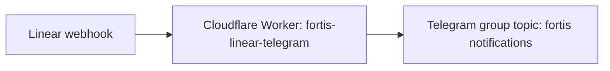

# Linear -> Telegram notifications

Дата: 2026-06-13

Статус: включено

## Назначение

Уведомления из Linear отправляются в Telegram-топик `fortis notifications`, чтобы команда видела изменения по задачам без ручной пересылки.

## Схема

## Runtime

- Cloudflare Worker: `fortis-linear-telegram`
- Healthcheck: `https://fortis-linear-telegram.galyamdin.workers.dev/health`
- Telegram group id: `-1004435908726`
- Telegram topic id: `124`

## Secrets

Секреты хранятся только в Cloudflare Worker secrets:

- `TELEGRAM_BOT_TOKEN`
- `TELEGRAM_CHAT_ID`
- `TELEGRAM_THREAD_ID`
- `WEBHOOK_PATH_SECRET`
- `LINEAR_WEBHOOK_SECRET`

Не коммитить Telegram bot token, Linear signing secret и полный webhook URL с path-secret в репозитории или заметки.

## Поведение

Worker принимает подписанные Linear webhook-события и отправляет краткие сообщения в Telegram. Основные события для уведомлений: изменения `Issue` и `Comment`.
