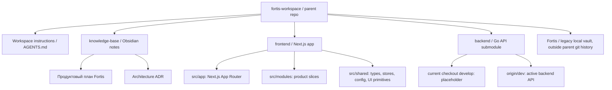
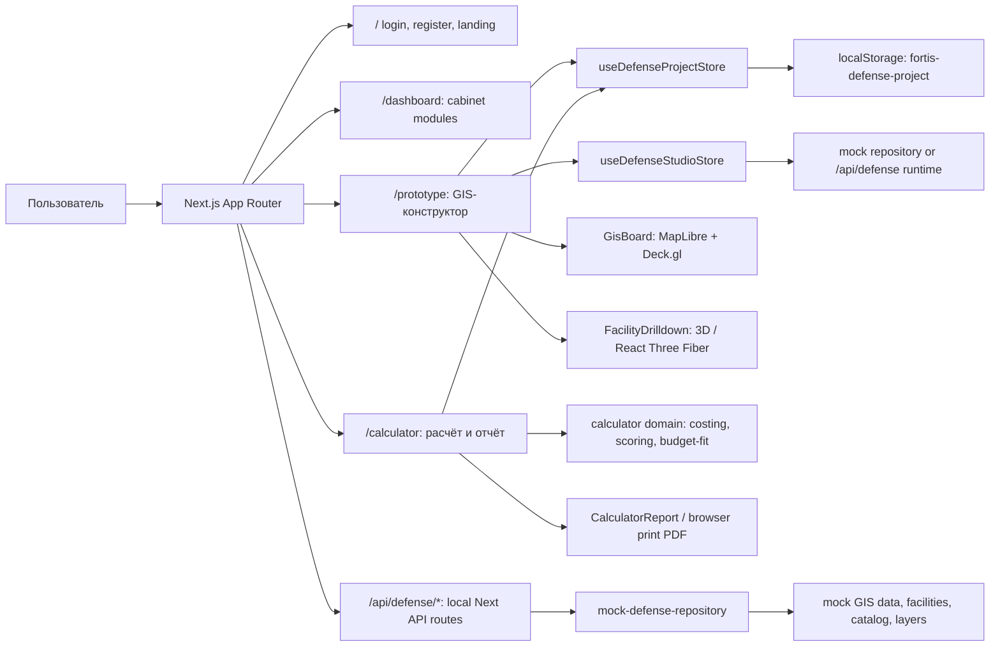
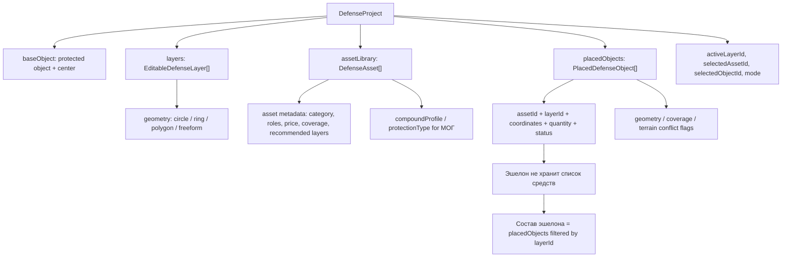
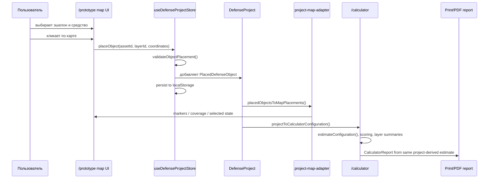
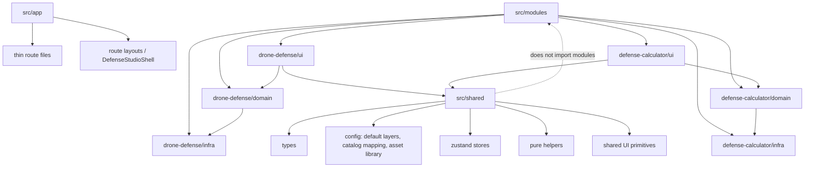
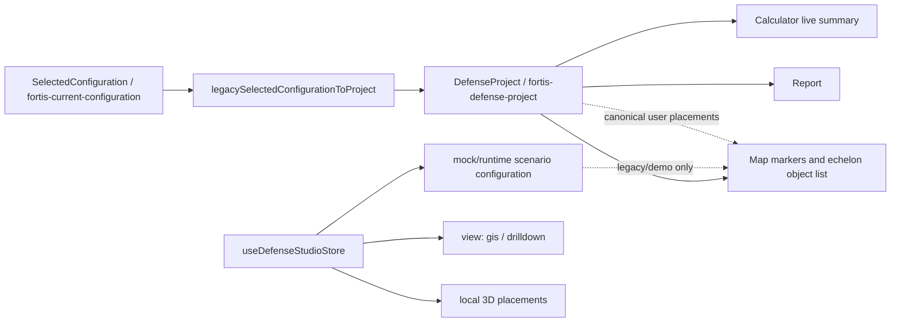
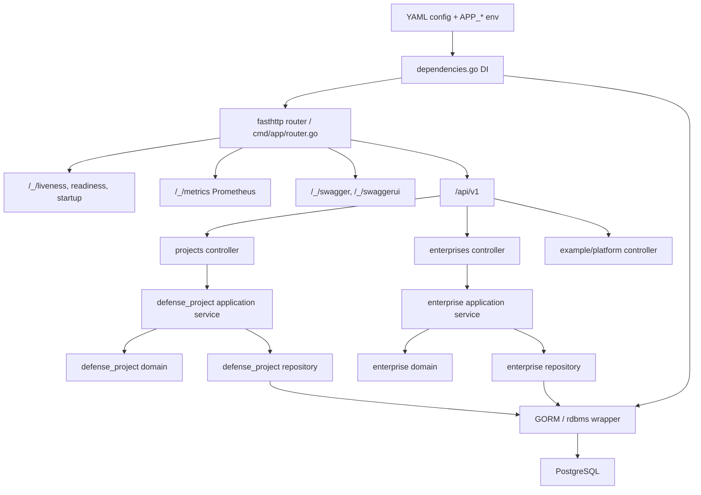
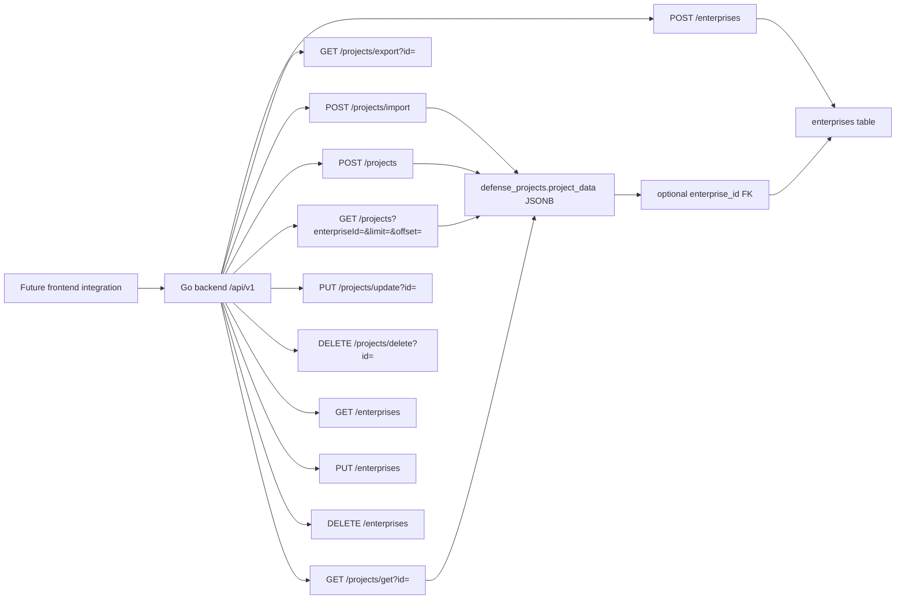
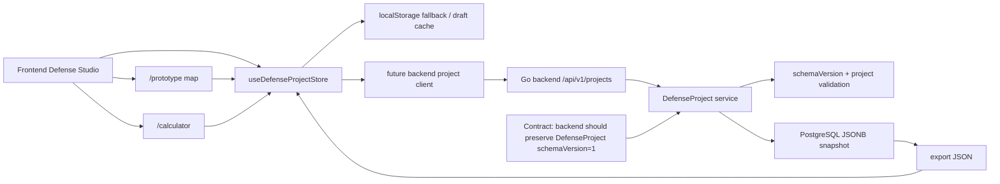

# Схемы архитектуры Fortis

Дата: 2026-06-13

Статус: обзор текущего workspace после `git fetch --all --prune` в parent, `frontend`, `backend`, `knowledge-base`.

Важно:

- Parent repo находится на `develop` и не отстаёт от `origin/develop`.
- `frontend` находится на `develop`, не отстаёт от `origin/develop`, но имеет локальные незакоммиченные изменения.
- `backend` в текущем checkout находится на `develop -> origin/develop` и содержит только шаблонный README.
- В `backend/origin/dev` есть актуальный Go backend с DDD-модулями, Postgres/GORM, probes/metrics и CRUD для `DefenseProject`/`Enterprise`.
- Parent repo сейчас показывает изменённый submodule pointer для `backend`: в parent записан `4041b12`, рабочий `backend/` стоит на `e2c4732`.

## 1. Карта репозиториев

## 2. Текущая runtime-архитектура frontend

## 3. Главный источник истины DefenseProject

## 4. Поток карта -> калькулятор -> отчёт

## 5. Модульные границы frontend

## 6. Исторические и текущие модели состояния

## 7. Backend `origin/dev` архитектура

## 8. Backend `origin/dev` API срез

## 9. Целевая интеграционная схема

## 10. Ключевые архитектурные факты

- MVP сфокусирован на 2D GIS-конструкторе: объект, карта, эшелоны, библиотека средств, размещение, покрытие, стоимость, отчёт.
- `DefenseProject.layers`, `DefenseProject.placedObjects`, `DefenseProject.assetLibrary` являются основной моделью пользовательской конфигурации.
- `/prototype` и `/calculator` уже связаны через один `DefenseProject`, а не через отдельные локальные состояния.
- `useDefenseStudioStore` остаётся для mock/runtime сценариев и 3D drill-down, но не должен становиться расчётным источником пользовательских размещений.
- Next API routes `/api/defense/*` сейчас обслуживают mock-данные frontend-прототипа.
- Реальный backend API уже виден в `backend/origin/dev`, но текущий рабочий checkout сабмодуля `backend` не переключён на эту ветку.
- Ближайшая интеграционная граница: заменить `localStorage` как единственный persistence слой на backend CRUD/import/export, сохранив схему `DefenseProject`.
